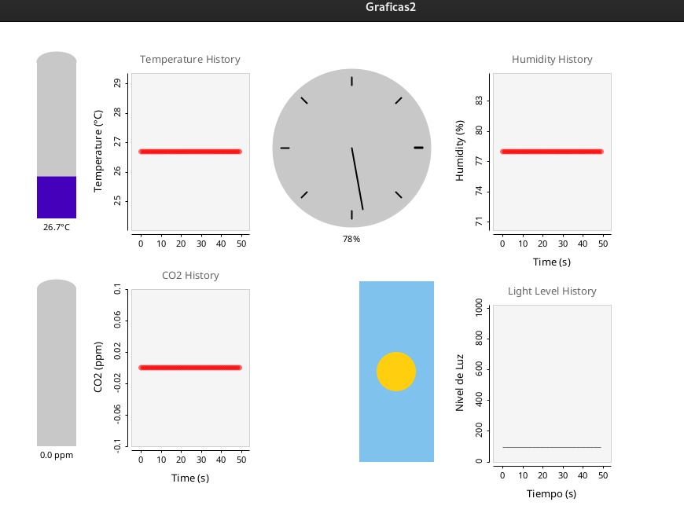
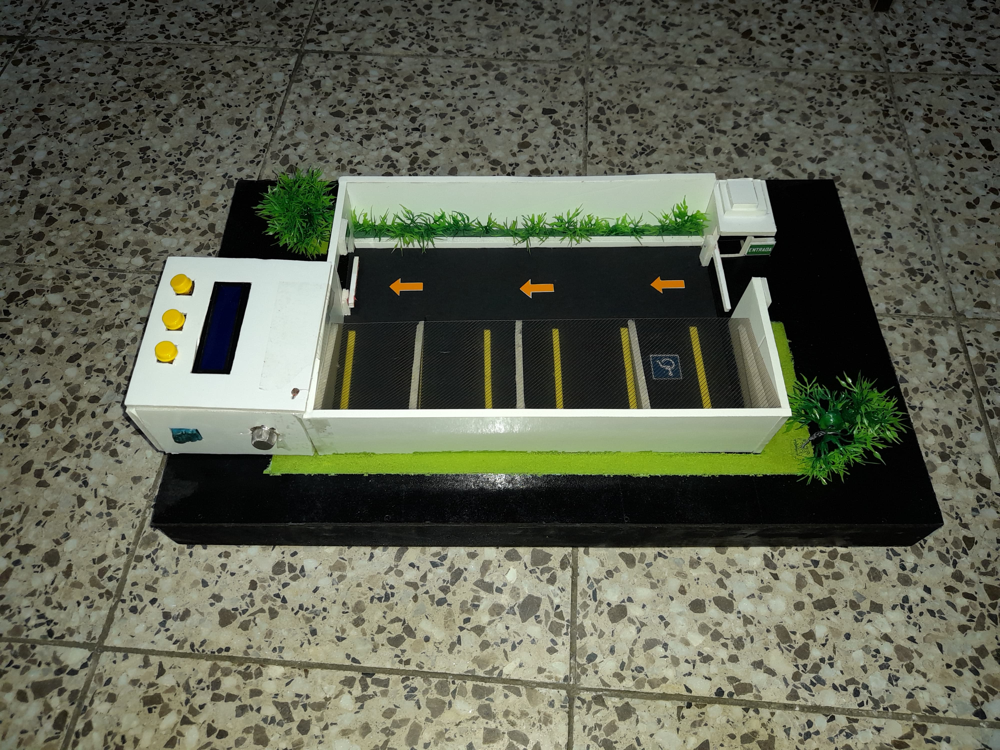
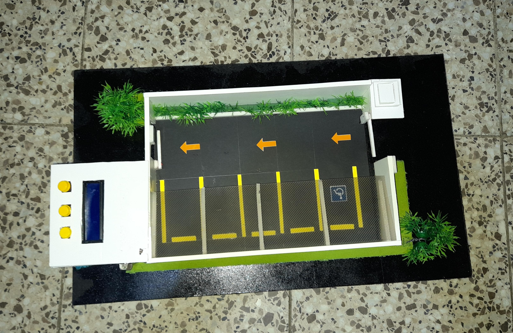
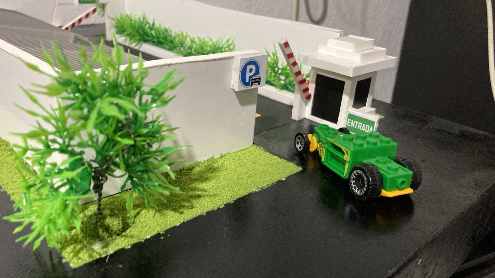
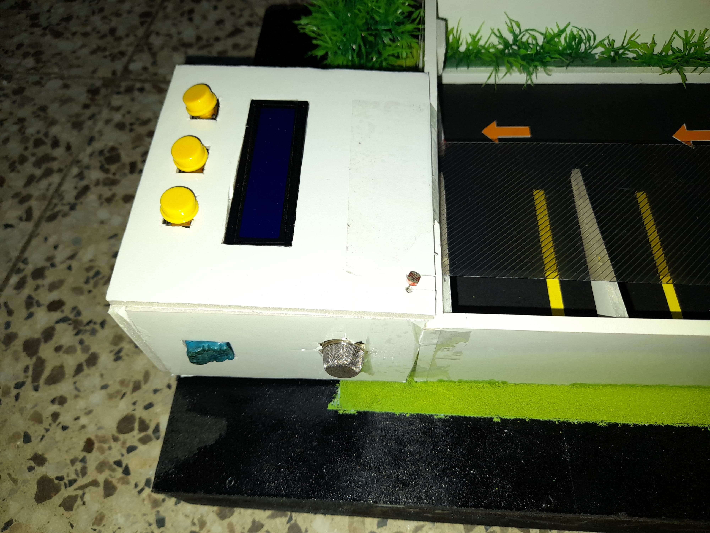

<h1 align="center">Proyecto 01</h1>

<div align="center">
📕 Arquitectura De Computadoras y Ensambladores 2
</div>
<div align="center"> 🏛 Universidad San Carlos de Guatemala</div>
<div align="center"> 📆 Segundo Semestre 2024</div>
<div align="center">📎 Grupo 05</div>

#### 📍 CONTROL DE ACCESO VEHICULAR CON IOT
*Este proyecto consiste en el desarrollo de un sistema de control de acceso vehicular mejorado mediante la implementación de una estación meteorológica basada en IoT. Este sistema está diseñado para recopilar datos meteorológicos en tiempo real y utilizar estos datos para optimizar el control climático del entorno.*

##### OBJETIVOS
- **Diseñar un dispositivo IoT** para medir y registrar variables meteorológicas como temperatura, humedad, iluminación y concentración de CO2.
- **Desarrollar un algoritmo de análisis de datos** que interprete la información meteorológica y prediga patrones climáticos relevantes.
- **Implementar una plataforma centralizada de gestión** que integre datos meteorológicos y controle dispositivos en el sistema de acceso vehicular.
- **Desarrollar un sistema de visualización de datos** que facilite el reconocimiento y análisis de información relevante para el usuario final.

---
#### **CAPAS STACK IOT FRAMEWORK IMPLEMENTADAS**
##### **SENSORES**
Los sensores son la primera capa del Stack IoT Framework y son responsables de la recopilación de datos meteorológicos y de proximidad. Los sensores implementados en este proyecto incluyen:
- **Sensor de Temperatura y Humedad (DHT11)**: EstE sensores miden la temperatura y humedad del ambiente.
- **Sensor de CO2 (MQ2)**: Este sensor mide la concentración de CO2 en el aire para evaluar la calidad del aire.
- **Sensor de Iluminación (LDR)**: Este sensor mide la cantidad de luz en el ambiente utilizando una fotocelda.
- **Sensor de Movimiento (HC-SR04)**: Este sensor detecta la proximidad de objetos y personas.
- **Pantalla LCD**: Muestra la información recopilada en tiempo real al usuario.
- **LED Infrarrojo**: Indica el estado de un evento en el sistema, como la detección de movimiento.

##### **CONECTIVIDAD**
La capa de conectividad se encarga de la transmisión de datos desde los sensores al microcontrolador Arduino y su posterior envío a la plataforma centralizada. La conectividad se logra a través de cables que conectan el Arduino a una computadora, desde donde los datos son procesados y visualizados en tiempo real usando Processing.

##### **PRODUCT INFRASTRUCTURE**
Esta capa incluye la infraestructura física del sistema, principalmente el microcontrolador Arduino, la pantalla LCD para la presentación de datos y los botones para la interacción del usuario.

##### **ANALYTICS**
La capa de análisis de datos es crucial para interpretar la información meteorológica recopilada. En este proyecto, el análisis de datos se realiza utilizando Processing, lo que permite visualizar los datos en tiempo real y tomar decisiones basadas en ellos.

##### **SMART APP**
En fases futuras, se desarrollarán aplicaciones que permitirán a los usuarios interactuar con el sistema y tomar decisiones basadas en los datos meteorológicos. En la fase 1, se establecen las bases para esta capa.

---

#### Sensor LDR
Este código permite medir la cantidad de luz en el ambiente utilizando un sensor LDR , este dato es enviado a processing para generar una grafica.
```arduino

int ldrPin = A1;
void setup() {
  Serial.begin(9600);
}

void loop() {
  int ldrValue = analogRead(ldrPin);
  Serial.print("LDR Value: ");
  Serial.println(ldrValue);
  delay(1000);
}

```

#### Pantalla LCD
Este código controla una pantalla LCD para mostrar mensajes y datos en tiempo real. La pantalla LCD se inicializa y muestra un mensaje de bienvenida al arrancar.
```arduino

#include <LiquidCrystal.h>

void lcdInicio(){
  lcd.clear();
  lcd.setCursor(0,0);
  lcd.print("***Bienvenido***");
  lcd.setCursor(0,1);
  lcd.print("Fase 1 - Grupo 5");  
}

```

#### Sensor DHT11
Este código se utiliza para leer la temperatura y la humedad del ambiente utilizando el sensor DHT11. Los valores de temperatura y humedad se imprimen en el monitor serial y son enviados al processing para generar una grafica.

```arduino

#include <DHT.h>
#define DHTPIN 2
#define DHTTYPE DHT11

DHT dht(DHTPIN, DHTTYPE);

void setup() {
  Serial.begin(9600);
  dht.begin();
}

void loop() {
  float humidity = dht.readHumidity();
  float temperature = dht.readTemperature();
  Serial.print("Humedad: ");
  Serial.print(humidity);
  Serial.print("%  Temperatura: ");
  Serial.print(temperature);
  Serial.println("C");
  delay(2000);
}

```

#### Sensor MQ2
Este código mide la concentración de CO2 en el aire usando el sensor MQ2. El valor analógico leído del pin A0 se imprime en el monitor serial.
```arduino

float LeerSensor(int pin_mq) {
    int i;
    float rs = 0;

    for (i = 0; i < TIEMPOS_MUESTRA_LECTURA; i++) {
        rs += CalcularResistenciaSensor(analogRead(pin_mq));
        delay(INTERVALO_MUESTRA_LECTURA);
    }

    rs = rs / TIEMPOS_MUESTRA_LECTURA;
    return rs; 
}

long ObtenerPorcentajeGas(float rs_ro_ratio, int id_gas) {
    return CalcularPorcentaje(rs_ro_ratio, CO2);
}

long CalcularPorcentaje(float rs_ro_ratio, float *curva) {
    return (pow(10, ((log(rs_ro_ratio) - curva[1]) / curva[2]) + curva[0]));
}

```

#### LED Infrarrojo
Este código enciende y apaga un LED infrarrojo conectado al pin 9 del Arduino. El LED parpadea cada segundo.
```arduino

int ledPin = 9;

void setup() {
  pinMode(ledPin, OUTPUT);
}

void loop() {
  digitalWrite(ledPin, HIGH);
  delay(1000);
  digitalWrite(ledPin, LOW);
  delay(1000);
}

```

#### PROCESSING
El código de Processing se utiliza para visualizar los datos recopilados por los sensores en tiempo real. Este código recibe los datos enviados desde el Arduino y los representa gráficamente en una ventana interactiva. La interfaz gráfica permite al usuario ver de manera visual la información que proviene de los sensores, facilitando la interpretación de los datos.



```java
import processing.serial.*;
import grafica.*;

void setup() {
  // Configuraciones iniciales para la visualización de gráficos
  size(1000, 800);                           //tamanio ventana principal     
  smooth();
  //println(Serial.list());
  
  // Configuración del gráfico de temperatura
  plotTemperature = new GPlot(this);
  plotTemperature.setPos(100, 25);
  plotTemperature.setDim(150, 200);
  plotTemperature.getXAxis().setAxisLabelText("Time (s)");
  plotTemperature.getYAxis().setAxisLabelText("Temperature (°C)");
  plotTemperature.setTitleText("Temperature History");
  
  // Configuración del gráfico de humedad
  plotHumidity = new GPlot(this);
  plotHumidity.setPos(560, 25);  // Posición al lado del gráfico de temperatura
  plotHumidity.setDim(150, 200);
  plotHumidity.getXAxis().setAxisLabelText("Time (s)");
  plotHumidity.getYAxis().setAxisLabelText("Humidity (%)");
  plotHumidity.setTitleText("Humidity History");
  
  // Configuración del gráfico de CO2
  plotCO2 = new GPlot(this);
  plotCO2.setPos(100, 300);  // Posición debajo del gráfico de temperatura
  plotCO2.setDim(150, 200);
  plotCO2.getXAxis().setAxisLabelText("Time (s)");
  plotCO2.getYAxis().setAxisLabelText("CO2 (ppm)");
  plotCO2.setTitleText("CO2 History");
  
  // configuracion del gráfico LDR
  configurarGraficoLuz();                    
  
  // Comentar y descomentar segun sea necesario.
  //String portName = Serial.list()[0];
  String portName = "/dev/ttyACM0"; 
  myPort = new Serial(this, portName, 9600);
}

void draw() {
  background(255);
  
  if (myPort.available() > 0) {
    String inData = myPort.readStringUntil('\n');
    if (inData != null) {
      inData = trim(inData); // Eliminar espacios en blanco
      String[] values = split(inData, ',');
      if (values.length == 4) {
        humidity = float(values[0]);
        temperature = float(values[1]);
        co2 = float(values[2]);
        valorLuz = int(values[3]);
        println("Humedad: ", humidity, " | Temperatura: ", temperature, " | CO2: ", co2, " | Luz: ", valorLuz);
      }
    }
  }
  
  CantidadLuminosidad();  // procesa la grafica y animacion LDR
  TempGraph();
  humiGraph();
  co2Graph();

  delay(100);
}

```

### Prototipo

El prototipo desarrollado en esta fase incluye los siguientes componentes:

- **Microcontrolador Arduino**: El cerebro del sistema, encargado de procesar los datos de los sensores y controlar los actuadores como la pantalla LCD.
- **Sensores**: Incluye sensores de temperatura y humedad (DHT11), calidad del aire (MQ2), iluminación (LDR) y Modulo TCS3200 (detector de color), y proximidad (HC-SR04).
- **Actuadores**: Una pantalla LCD para mostrar la información.
- **Conectividad**: Comunicación entre el Arduino y una computadora a través de un cable USB, con visualización de datos en Processing.
- **Interfaz de Usuario**: Botones físicos en el prototipo permiten la interacción del usuario, como mostrar datos en tiempo real o acceder a información almacenada.


|  |  |
|------------------------------|------------------------------|
|  |  |
---