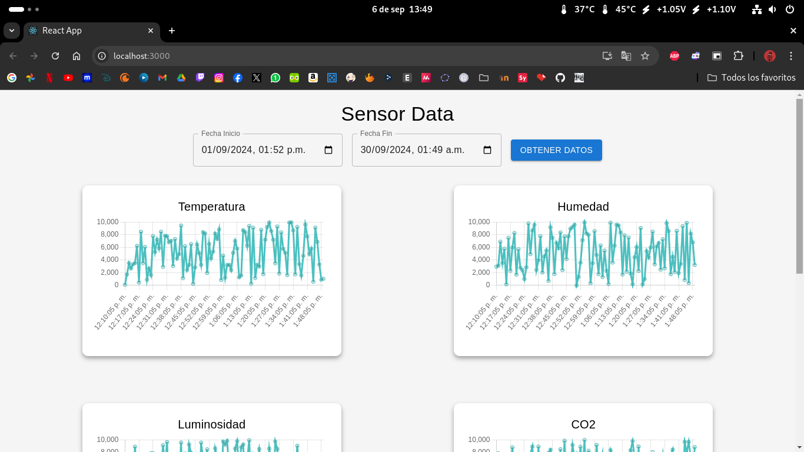
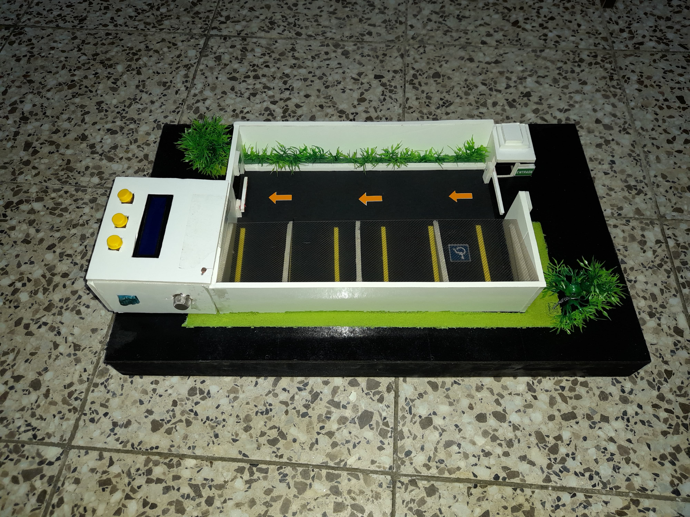
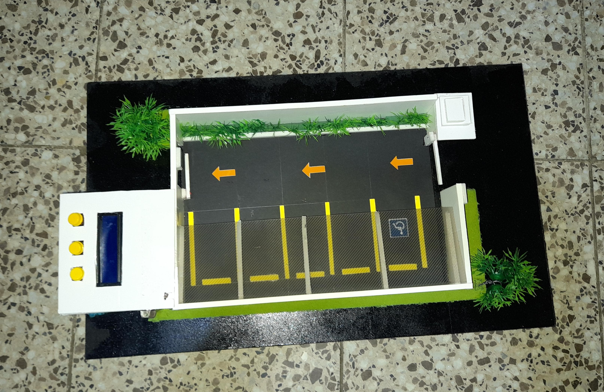
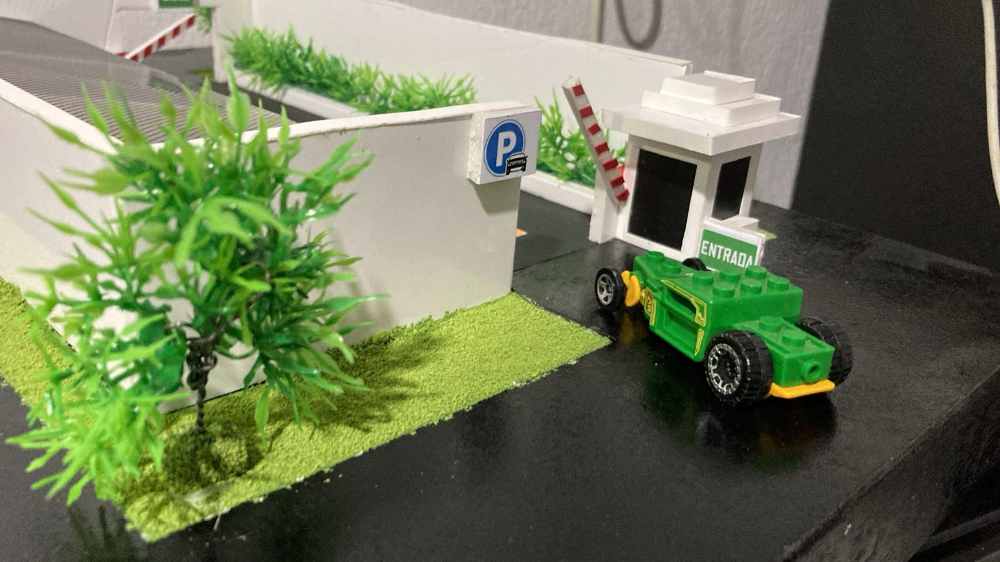
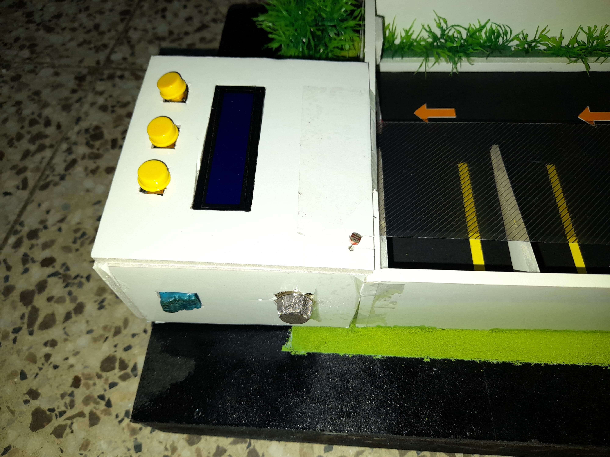
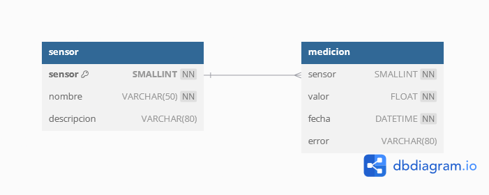
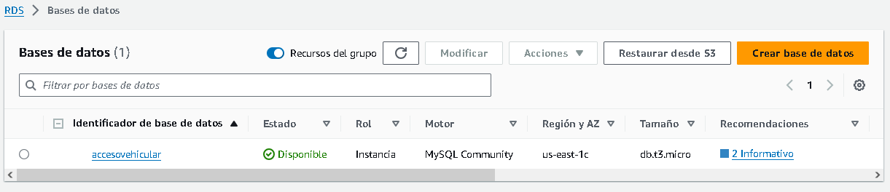

<h1 align="center">Proyecto 01</h1>

<div align="center">
📕 Arquitectura De Computadoras y Ensambladores 2
</div>
<div align="center"> 🏛 Universidad San Carlos de Guatemala</div>
<div align="center"> 📆 Segundo Semestre 2024</div>
<div align="center">📎 Grupo 05</div>

#### 📍 CONTROL DE ACCESO VEHICULAR CON IOT
*Este proyecto consiste en el desarrollo de un sistema de control de acceso vehicular mejorado mediante la implementación de una estación meteorológica basada en IoT. Este sistema está diseñado para recopilar datos meteorológicos en tiempo real y utilizar estos datos para optimizar el control climático del entorno.*

##### OBJETIVOS
- **Diseñar un dispositivo IoT** para medir y registrar variables meteorológicas como temperatura, humedad, iluminación y concentración de CO2.
- **Desarrollar un algoritmo de análisis de datos** que interprete la información meteorológica y prediga patrones climáticos relevantes.
- **Implementar una plataforma centralizada de gestión** que integre datos meteorológicos y controle dispositivos en el sistema de acceso vehicular.
- **Desarrollar un sistema de visualización de datos** que facilite el reconocimiento y análisis de información relevante para el usuario final.

---
#### **CAPAS STACK IOT FRAMEWORK IMPLEMENTADAS**
##### **SENSORES**
Los sensores son la primera capa del Stack IoT Framework y son responsables de la recopilación de datos meteorológicos y de proximidad. Los sensores implementados en este proyecto incluyen:
- **Sensor de Temperatura y Humedad (DHT11)**: EstE sensores miden la temperatura y humedad del ambiente.
- **Sensor de CO2 (MQ2)**: Este sensor mide la concentración de CO2 en el aire para evaluar la calidad del aire.
- **Sensor de Iluminación (LDR)**: Este sensor mide la cantidad de luz en el ambiente utilizando una fotocelda.
- **Sensor de Movimiento (HC-SR04)**: Este sensor detecta la proximidad de objetos y personas.
- **Pantalla LCD**: Muestra la información recopilada en tiempo real al usuario.
- **LED Infrarrojo**: Indica el estado de un evento en el sistema, como la detección de movimiento.

##### **CONECTIVIDAD**
La capa de conectividad se encarga de la transmisión de datos desde los sensores al microcontrolador Arduino y su posterior envío a la plataforma centralizada. La conectividad se logra a través de cables que conectan el Arduino a una computadora, desde donde los datos son procesados y visualizados en tiempo real usando Processing.

##### **PRODUCT INFRASTRUCTURE**
Esta capa incluye la infraestructura física del sistema, principalmente el microcontrolador Arduino, la pantalla LCD para la presentación de datos y los botones para la interacción del usuario.

##### **ANALYTICS**
La capa de análisis de datos es crucial para interpretar la información meteorológica recopilada. En este proyecto, el análisis de datos se realiza utilizando Processing, lo que permite visualizar los datos en tiempo real y tomar decisiones basadas en ellos.

##### **SMART APP**
En fases futuras, se desarrollarán aplicaciones que permitirán a los usuarios interactuar con el sistema y tomar decisiones basadas en los datos meteorológicos. En la fase 1, se establecen las bases para esta capa.

---

#### Sensor LDR
Este código permite medir la cantidad de luz en el ambiente utilizando un sensor LDR , este dato es enviado a processing para generar una grafica.
```arduino

int ldrPin = A1;
void setup() {
  Serial.begin(9600);
}

void loop() {
  int ldrValue = analogRead(ldrPin);
  Serial.print("LDR Value: ");
  Serial.println(ldrValue);
  delay(1000);
}

```

#### Pantalla LCD
Este código controla una pantalla LCD para mostrar mensajes y datos en tiempo real. La pantalla LCD se inicializa y muestra un mensaje de bienvenida al arrancar.
```arduino

#include <LiquidCrystal.h>

void lcdInicio(){
  lcd.clear();
  lcd.setCursor(0,0);
  lcd.print("***Bienvenido***");
  lcd.setCursor(0,1);
  lcd.print("Fase 1 - Grupo 5");  
}

```

#### Sensor DHT11
Este código se utiliza para leer la temperatura y la humedad del ambiente utilizando el sensor DHT11. Los valores de temperatura y humedad se imprimen en el monitor serial y son enviados al processing para generar una grafica.

```arduino

#include <DHT.h>
#define DHTPIN 2
#define DHTTYPE DHT11

DHT dht(DHTPIN, DHTTYPE);

void setup() {
  Serial.begin(9600);
  dht.begin();
}

void loop() {
  float humidity = dht.readHumidity();
  float temperature = dht.readTemperature();
  Serial.print("Humedad: ");
  Serial.print(humidity);
  Serial.print("%  Temperatura: ");
  Serial.print(temperature);
  Serial.println("C");
  delay(2000);
}

```

#### Sensor MQ2
Este código mide la concentración de CO2 en el aire usando el sensor MQ2. El valor analógico leído del pin A0 se imprime en el monitor serial.
```arduino

float LeerSensor(int pin_mq) {
    int i;
    float rs = 0;

    for (i = 0; i < TIEMPOS_MUESTRA_LECTURA; i++) {
        rs += CalcularResistenciaSensor(analogRead(pin_mq));
        delay(INTERVALO_MUESTRA_LECTURA);
    }

    rs = rs / TIEMPOS_MUESTRA_LECTURA;
    return rs; 
}

long ObtenerPorcentajeGas(float rs_ro_ratio, int id_gas) {
    return CalcularPorcentaje(rs_ro_ratio, CO2);
}

long CalcularPorcentaje(float rs_ro_ratio, float *curva) {
    return (pow(10, ((log(rs_ro_ratio) - curva[1]) / curva[2]) + curva[0]));
}

```

#### LED Infrarrojo
Este código enciende y apaga un LED infrarrojo conectado al pin 9 del Arduino. El LED parpadea cada segundo.
```arduino

int ledPin = 9;

void setup() {
  pinMode(ledPin, OUTPUT);
}

void loop() {
  digitalWrite(ledPin, HIGH);
  delay(1000);
  digitalWrite(ledPin, LOW);
  delay(1000);
}

```

#### Sensor RC522
Este código se utiliza para leer la tarjeta RFID utilizando el sensor RC522.
```arduino
#include <MFRC522.h>

#define SS_PIN 10
#define RST_PIN 9
MFRC522 rfid(SS_PIN, RST_PIN);

// Declarar una lista de NUIDs conocidos
byte NUIDsConocidos[][4] = {
  {0xA1, 0xB2, 0xC3, 0xD4},
  {0x01, 0x02, 0x03, 0x04},
  {0xFF, 0xEE, 0xDD, 0xCC}
};

// Número de NUIDs que se han almacenado
int cantidadNUIDs = sizeof(NUIDsConocidos) / sizeof(NUIDsConocidos[0]);

void setup() {
  SPI.begin();
  rfid.PCD_Init();
}

void leerTarjetaRFID() {
  // Revisar si hay una tarjeta presente
  if (!rfid.PICC_IsNewCardPresent()) {
    return false; // Si no hay tarjeta, salimos de la función
  }

  // Revisar si la tarjeta puede ser leída
  if (!rfid.PICC_ReadCardSerial()) {
    return false; // Si no puede ser leída, salimos de la función
  }

  // Comparar el NUID con la lista de NUIDs conocidos
  if (tarjetaEsConocida(rfid.uid.uidByte)) {
    rfid.PICC_HaltA();
    return true;
  } else {
    rfid.PICC_HaltA();
    return false;
  }
}

// Función para comparar la tarjeta leída con la lista de NUIDs conocidos
bool tarjetaEsConocida(byte* nuidLeido) {
  for (int i = 0; i < cantidadNUIDs; i++) {
    bool coinciden = true;
    for (int j = 0; j < 4; j++) {
      if (NUIDsConocidos[i][j] != nuidLeido[j]) {
        coinciden = false;
        break; // Salir si no coinciden
      }
    }
    if (coinciden) {
      return true; // Si los 4 bytes coinciden, la tarjeta es reconocida
    }
  }
  return false; // Si ninguna coincidió, la tarjeta no es reconocida
}
```

#### Servo Motor
Este codigo controla un servo motor conectado al arduino, dependiendo del sensor rfid se activa el servo motor.
```arduino
#include <Servo.h>

bool barreraAbierta = false;           // Estado inicial de la barrera: cerrada

void controlarBarrera() {
    if (leerTarjetaRFID() && !barreraAbierta) {  // Abre la barrera si se detecta una tarjeta valida, barrera cerrada
        abrirBarrera();                                 // abre a 90 grados
        barreraAbierta = true;                          // Marca la barrera como abierta
    }

    // Lee el estado del sensor infrarrojo
    int irValue = digitalRead(irSensor);  

    // Cierre de la barrera tras verificar que no hay obstaculos
    if (barreraAbierta && irValue == HIGH) {  
        delay(5000);                                   // Espera 5 segundos para permitir el paso completo del auto
        cerrarBarrera(); 
        barreraAbierta = false;                        // Marca la barrera como cerrada
    } else if (barreraAbierta && irValue == LOW) {
                                                       // La barrera permanece abierta si se detecta un obstaculo en el infrarojo (0)
    }
}

// Función para abrir la barrera
void abrirBarrera() {
    myServo.write(90);                                 // Mueve el servomotor a 90 grados para abrir la barrera
}

void cerrarBarrera() {
    myServo.write(0);                                  // Mueve el servomotor a 0 grados para cerrar la barrera
}
```

#### Ultrasonico
Este código controla un sensor de proximidad ultrasónico HC-SR04 para detectar la distancia de un objeto. Dependiendo de la distancia, se encienden diferentes colores de LED.

```arduino

const int Trigger = 45;   
const int Echo = 47;      
const int LedRojo = 53;   
const int LedVerde = 49;  

unsigned long tiempoInicioRojo = 0;  // Variable para almacenar el tiempo cuando se enciende el rojo
bool rojoEncendido = false;          // Indicador de si el LED rojo está encendido
bool cambiarAAmarillo = false;       // Indicador para cambiar a amarillo después de los 5 segundos

void setup(){
  pinMode(Trigger, OUTPUT);  // Pin como salida para el Trigger
  pinMode(Echo, INPUT);      // Pin como entrada para el Echo
  pinMode(LedRojo, OUTPUT);  // Pin como salida para el color rojo
  pinMode(LedVerde, OUTPUT); // Pin como salida para el color verde
  digitalWrite(Trigger, LOW); // Inicializamos el Trigger en bajo
}

void loop(){
  valorDistancia = distancia();
  ultrasonico(valorDistancia);
}

int distancia(){
  long t; // Tiempo que demora en llegar el eco
  long d; // Distancia en centímetros

  // Enviar pulso de Trigger
  digitalWrite(Trigger, HIGH);
  delayMicroseconds(10); // Enviamos un pulso de 10us
  digitalWrite(Trigger, LOW);

  t = pulseIn(Echo, HIGH); // Obtenemos el ancho del pulso
  d = t / 59;              // Escalamos el tiempo a una distancia en cm

  return d;
}

void ultrasonico(int d) {

  // Comportamiento cuando la distancia es <= 5 cm
  if (d <= 5 && !rojoEncendido && !cambiarAAmarillo) {
    // Si el LED rojo no está encendido y aún no ha cambiado a amarillo
    digitalWrite(LedRojo, HIGH);
    digitalWrite(LedVerde, LOW); // Apagar verde
    tiempoInicioRojo = millis(); // Guardamos el tiempo de inicio
    rojoEncendido = true;        // Indicamos que el rojo está encendido
  }

  // Verificar si han pasado 5 segundos desde que el LED rojo se encendió
  if (rojoEncendido && millis() - tiempoInicioRojo >= 5000) {
    // Después de 5 segundos, cambiar a amarillo (rojo + verde)
    digitalWrite(LedRojo, HIGH);
    digitalWrite(LedVerde, HIGH); // Encender verde para obtener amarillo
    cambiarAAmarillo = true;      // Indicamos que ya se cambió a amarillo
    rojoEncendido = false;        // Apagamos el estado de espera de rojo
  }

  // Si la distancia está entre 5 y 10 cm o si ya hemos cambiado a amarillo después de <= 5 cm
  if ((d > 5 && d <= 10) || cambiarAAmarillo) {
    digitalWrite(LedRojo, HIGH);
    digitalWrite(LedVerde, HIGH); // Mantener el amarillo encendido
  }

  // Si la distancia es mayor a 10 cm, apagar todos los colores y reiniciar estado
  if (d > 10) {
    digitalWrite(LedRojo, LOW);
    digitalWrite(LedVerde, LOW);
    cambiarAAmarillo = false;   // Reiniciar estado de cambio a amarillo
    rojoEncendido = false;      // Reiniciar estado del rojo
  }

  delay(100); // Pausa de 100 ms para evitar lecturas muy frecuentes
}
```


#### DASHBOARD
El dashboard en React se utiliza para visualizar en un intervalo de tiempo determinado los datos recopilados por los sensores. Estos datos son almacenados en una base de datos (DB) y el dashboard los recupera para representarlos de manera gráfica e interactiva en una interfaz web. La interfaz permite al usuario monitorear y analizar fácilmente la información proveniente de los sensores, mejorando la interpretación y toma de decisiones basada en los datos.



```javascript

  return (
    <div className="App">
      <header className="App-header">
        <Typography variant="h4" gutterBottom>
          Sensor Data
        </Typography>

        <Grid container spacing={2} justifyContent="center" alignItems="center">
          <Grid item>
            <TextField
              label="Fecha Inicio"
              type="datetime-local"
              value={startTime}
              onChange={(e) => setStartTime(e.target.value)}
              InputLabelProps={{
                shrink: true,
              }}
            />
          </Grid>
          <Grid item>
            <TextField
              label="Fecha Fin"
              type="datetime-local"
              value={endTime}
              onChange={(e) => setEndTime(e.target.value)}
              InputLabelProps={{
                shrink: true,
              }}
            />
          </Grid>
          <Grid item>
            <Button variant="contained" onClick={handleFetchData}>
              Obtener Datos
            </Button>
          </Grid>
        </Grid>

        <Box mt={4} className="grid-container">
            {sensorData.map((data, index) => (
              <Grid item xs={12} sm={6} md={4} key={index}>
                <ChartComponent data={data} title={sensorNames[index]} />
              </Grid>
            ))}
        </Box>
      </header>
    </div>
  );
}

```

### Prototipo

El prototipo desarrollado en esta fase incluye los siguientes componentes:

- **Microcontrolador Arduino**: El cerebro del sistema, encargado de procesar los datos de los sensores y controlar los actuadores como la pantalla LCD.
- **Sensores**: Incluye sensores de temperatura y humedad (DHT11), calidad del aire (MQ2), iluminación (LDR) y Modulo TCS3200 (detector de color), y proximidad (HC-SR04).
- **Actuadores**: Una pantalla LCD para mostrar la información.
- **Conectividad**: Comunicación entre el Arduino y una computadora a través de un cable USB, con visualización de datos en Processing.
- **Interfaz de Usuario**: Botones físicos en el prototipo permiten la interacción del usuario, como mostrar datos en tiempo real o acceder a información almacenada.


|  |  |
|------------------------------|------------------------------|
|  |  |
---

1. **Statsmodels (ARIMA)**
Descripción: Statsmodels es una librería potente para análisis estadístico en Python. ARIMA (AutoRegressive Integrated Moving Average) es uno de los modelos más utilizados para la predicción de series temporales.

Cuándo usar ARIMA:

Cuando los datos climáticos (como temperatura, humedad) tienen una relación temporal (dependen de valores pasados).
Funciona bien cuando los datos no tienen patrones estacionales claros.

```python
  import pandas as pd
  from statsmodels.tsa.arima_model import ARIMA

  # Cargar datos históricos
  data = pd.read_csv('historical_data.csv', index_col='date', parse_dates=True)
  # Crear modelo ARIMA (p=5, d=1, q=0 es un ejemplo de orden)
  model = ARIMA(data['temperature'], order=(5, 1, 0))
  model_fit = model.fit(disp=0)

  # Predicciones
  forecast = model_fit.forecast(steps=10)  # Predice 10 puntos futuros
  print(forecast)

```


Ventajas:

  Bien conocido en la comunidad estadística.
  Adecuado para predicciones a corto plazo.

Desventajas:

  No es ideal si los datos tienen patrones estacionales.

**2. Facebook Prophet**
Descripción: Prophet es una biblioteca de Facebook diseñada para realizar pronósticos de series temporales. Es fácil de usar y maneja automáticamente los componentes de tendencia y estacionalidad, ideal para datos climáticos.

Cuándo usar Prophet:

Si tus datos presentan estacionalidad (como los patrones diarios de temperatura o humedad).
Ideal si quieres obtener predicciones fácilmente ajustadas para diferentes períodos de tiempo.

```python

from fbprophet import Prophet
import pandas as pd

# Cargar datos históricos y ajustarlos para Prophet
data = pd.read_csv('historical_data.csv')
data = data.rename(columns={'date': 'ds', 'temperature': 'y'})  # Renombrar para Prophet

# Crear modelo
model = Prophet()
model.fit(data)

# Hacer predicción para los próximos 10 días
future = model.make_future_dataframe(periods=10)
forecast = model.predict(future)

# Mostrar predicción
print(forecast[['ds', 'yhat', 'yhat_lower', 'yhat_upper']])


```

Ventajas:

Manejo automático de estacionalidades y días festivos.
Fácil de implementar y ajustar.
Desventajas:

Puede ser menos preciso para datos con poca tendencia.

**3. Scikit-learn (Regresión Lineal o Random Forest)**
Descripción: Scikit-learn es la librería más popular de Python para aprendizaje automático. Permite utilizar algoritmos como regresión lineal o Random Forest para realizar predicciones climáticas basadas en múltiples variables.

Cuándo usar Scikit-learn:

Cuando deseas hacer predicciones con múltiples entradas (como temperatura, humedad, presión).
Adecuado para modelos más complejos con datos multivariados.

```python

from sklearn.model_selection import train_test_split
from sklearn.linear_model import LinearRegression
import pandas as pd

# Cargar datos y definir variables predictoras (X) y el valor a predecir (y)
data = pd.read_csv('historical_data.csv')
X = data[['humidity', 'pressure']]  # Variables predictoras
y = data['temperature']  # Variable a predecir

# Dividir en datos de entrenamiento y prueba
X_train, X_test, y_train, y_test = train_test_split(X, y, test_size=0.2, random_state=0)

# Crear y entrenar el modelo
model = LinearRegression()
model.fit(X_train, y_train)

# Hacer predicciones
predictions = model.predict(X_test)
print(predictions)

```

Ventajas:

Flexible y adecuado para modelos complejos.
Soporte para múltiples algoritmos de machine learning.
Desventajas:

Requiere mayor trabajo de ajuste y validación.

### Modelo ER



### Instancia de la base de datos en RDS de AWS

